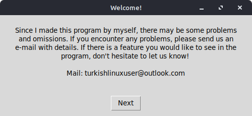

# Adhan Program



Adhan is a simple yet powerful application designed for Linux and Windows users to get accurate prayer times. The application allows easy configuration for different countries and cities and supports multiple languages, providing a user-friendly experience for a diverse audience.

## Features

- **Settings Section:** You can easily change your current city and country so that the program displays the correct information. There are also settings to change the language and the sound of the call to prayer. You don't have to use the default call to prayer sounds, you can add your own call to prayer right now!

- **Language Support:** The application currently supports these languages:
  - English
  - German
  - Turkish
  - Azerbaijani
  - French
  - Russian

If you are interested in volunteering for more language support, contact us: turkishlinuxuser@outlook.com

**Operating System support:** Works on all Linux distributions based on Fedora, Arch, Debian/Ubuntu, Windows 10 Home/Enterprise/Pro/LTSB/LTSC systems (tested) Windows 7,8,8.1 and 11 not tested. If you are using one of these and the program does not work on your operating system, you can contact us with the e-mail above.

## How to download?
### Linux:

First you need to download wget. If wget is not installed (it is usually installed by default), you need to download Wget. 

#### Fedora:
```
sudo dnf install wget
```

#### Arch:
```
sudo pacman -Sy wget
```

#### Debian/Ubuntu:
```
sudo apt install wget
```

After downloading the wget, download the installer script and run it:
```
wget -O install.sh https://raw.githubusercontent.com/TurkishLinuxUser/Adhan/main/install.sh
```
```
sh install.sh
```

### Windows:

1. Download [Adhan-Windows.rar](https://github.com/TurkishLinuxUser/Adhan/releases/download/3.0.0/Adhan-Windows.rar).
2. Extract the file
3. Open and install the setup file.

# Contributing
We welcome contributions from the community! If you'd like to contribute, please follow these steps:

1. Fork the repository.
2. Create a new branch for your feature or bugfix.
3. Make your changes.
4. Submit a pull request with a detailed description of your changes.

# License
This project is licensed under the GPL-3 License See the [License](license) file for more details.

# Support
If you encounter any issues or have any questions, please feel free to open an issue on GitHub or contact us directly.

